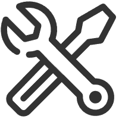

# Python工具箱

日常练习常用的工具开发

<!-- PROJECT SHIELDS -->

[![Contributors][contributors-shield]][contributors-url]
[![Forks][forks-shield]][forks-url]
[![Stargazers][stars-shield]][stars-url]
[![Issues][issues-shield]][issues-url]
[![MIT License][license-shield]][license-url]

<!-- PROJECT LOGO -->
 

  

  <h3 align="center">Python工具箱</h3>
  

    日常开发练习
     
    <a href="https://github.com/JBpeople/python_tools"><strong>探索本项目的文档 »</strong></a>
     
     
    <a href="https://github.com/JBpeople/python_tools">查看Demo</a>
    ·
    <a href="https://github.com/JBpeople/python_tools/issues">报告Bug</a>
    ·
    <a href="https://github.com/JBpeople/python_tools/issues">提出新特性</a>
  

 
## 目录
- [版本控制](#版本控制)
- [作者](#作者)
- [版权说明](#版权说明)

### 版本控制

该项目使用Git进行版本管理。您可以在repository参看当前可用版本。

### 作者

YangChangkun@lcmmljs@foxmail.com

### 版权说明

该项目签署了MIT 授权许可，详情请参阅 [LICENSE.txt](https://github.com/JBpeople/python_tools/blob/master/LICENSE.txt)

<!-- links -->
[your-project-path]:JBpeople/python_tools
[contributors-shield]: https://img.shields.io/github/contributors/JBpeople/python_tools.svg?style=flat-square
[contributors-url]: https://github.com/JBpeople/python_tools/graphs/contributors
[forks-shield]: https://img.shields.io/github/forks/JBpeople/python_tools.svg?style=flat-square
[forks-url]: https://github.com/JBpeople/python_tools/network/members
[stars-shield]: https://img.shields.io/github/stars/JBpeople/python_tools.svg?style=flat-square
[stars-url]: https://github.com/JBpeople/python_tools/stargazers
[issues-shield]: https://img.shields.io/github/issues/JBpeople/python_tools.svg?style=flat-square
[issues-url]: https://img.shields.io/github/issues/JBpeople/python_tools.svg
[license-shield]: https://img.shields.io/github/license/JBpeople/python_tools.svg?style=flat-square
[license-url]: https://github.com/JBpeople/python_tools/blob/master/LICENSE.txt
[linkedin-shield]: https://img.shields.io/badge/-LinkedIn-black.svg?style=flat-square&logo=linkedin&colorB=555
[linkedin-url]: https://linkedin.com/in/shaojintian

